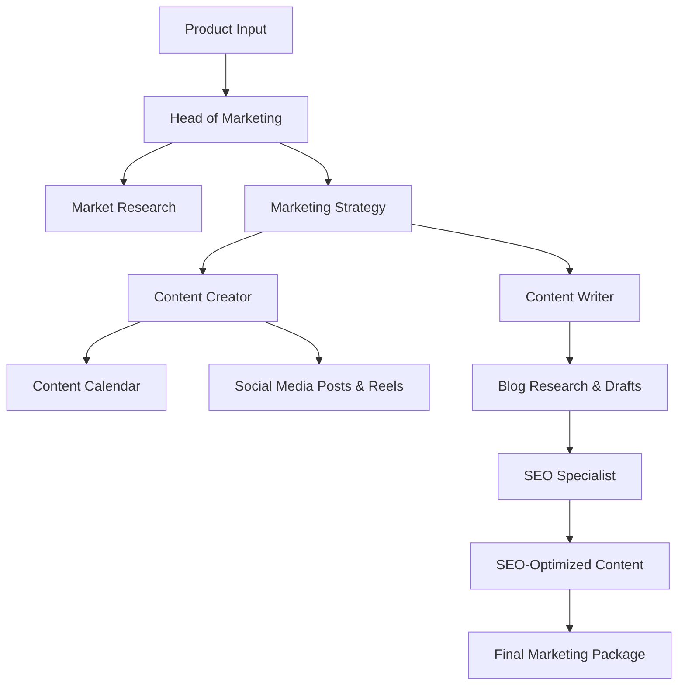

# 🧠 Marketing Crew
---
A Crew AI Project
> AI-Powered Marketing Automation System Built with CrewAI

[](https://www.python.org/downloads/)
[](https://www.crewai.com/)
[](LICENSE)

**Marketing Crew** is an intelligent marketing automation system that simulates a complete digital marketing team. Powered by CrewAI and Google's Gemini 2.5 Flash, it automates end-to-end marketing workflows—from market research and strategy development to content creation and SEO optimization.

---

## ✨ What It Does

Marketing Crew orchestrates multiple AI agents, each with specialized expertise, to deliver comprehensive marketing campaigns for any product or brand. The system handles:

- 📊 **Market Research** – Competitor analysis, trend identification, and audience insights
- 🎯 **Marketing Strategy** – Data-driven planning aligned with your budget and goals
- 📱 **Social Media Content** – Post drafts, content calendars, and reel scripts
- ✍️ **Blog Writing** – SEO-friendly, long-form content with structured formatting
- 🔍 **SEO Optimization** – Keywords, metadata, and search engine enhancements

---

## 🏗️ Architecture

The system follows a sequential workflow where agents collaborate and pass deliverables:



---

## 👥 The AI Team

| Agent | Role | Responsibilities |
|-------|------|------------------|
| **🎯 Head of Marketing** | Strategic Lead | Conducts market research, defines marketing strategy, and coordinates the team |
| **📱 Content Creator** | Social Media Manager | Generates post drafts, reel scripts, and content calendars |
| **✍️ Content Writer** | Blog Specialist | Researches topics and writes SEO-friendly blog posts |
| **🔍 SEO Specialist** | Optimization Expert | Enhances all content with keywords, tags, and metadata |

**Powered by:** Google Gemini 2.5 Flash with reasoning capabilities for contextual decision-making and creative content generation.

**Tools Used:** SerperDevTool, ScrapeWebsiteTool, DirectoryReadTool, FileWriterTool, FileReadTool

---

## 🔄 Workflow

### 1. Define Your Product

```python
inputs = {
    "product_name": "AI Powered Excel Automation Tool",
    "target_audience": "Small and Medium Enterprises (SMEs)",
    "product_description": "A tool that automates repetitive tasks in Excel using AI, saving time and reducing errors.",
    "budget": "Rs. 50,000",
    "current_date": "2025-11-02",
}
```

### 2. Launch the Crew

```python
crew = TheMarketingCrew()
crew.marketingcrew().kickoff(inputs=inputs)
```

### 3. Let AI Agents Collaborate

Agents execute tasks sequentially, each building upon the previous agent's work:

1. **Market Research** → Analyze competitors and identify opportunities
2. **Marketing Strategy** → Define objectives and tactical approach
3. **Content Calendar** → Plan posting schedule across platforms
4. **Post Drafts** → Create engaging social media content
5. **Reel Scripts** → Write short-form video scripts
6. **Blog Research** → Identify relevant topics and keywords
7. **Blog Drafts** → Generate complete blog posts
8. **SEO Optimization** → Enhance all content for search visibility

### 4. Review Your Deliverables

All outputs are saved to `/resources/drafts/`:
- 📊 Market research summary
- 🎯 Marketing strategy document
- 🗓️ Content calendar
- 📝 Social media posts and reel scripts
- 📰 SEO-optimized blog articles

---

## 🚀 Key Features

- **🤖 Multi-Agent Orchestration** – Autonomous AI agents collaborate like a real marketing team
- **⚡ Full Automation** – End-to-end workflow from research to final deliverables
- **📋 Structured Output** – Pydantic-based content schema ensures consistency
- **🔧 Modular Configuration** – Easily customize agents and tasks via YAML files
- **🧠 Reasoning-Enabled AI** – Context-aware LLM improves creativity and relevance
- **🌐 Integrated Research Tools** – Real-time web scraping and search capabilities
- **📁 Organized File Management** – Automatic saving and categorization of outputs

---

## 🛠️ Tech Stack

| Technology | Purpose |
|------------|---------|
| **CrewAI** | Multi-agent orchestration framework |
| **Google Gemini 2.5 Flash** | LLM for reasoning and content generation |
| **Python 3.10+** | Core programming language |
| **Pydantic** | Data validation and structured content |
| **YAML** | Agent and task configuration |
| **dotenv** | Secure environment variable management |

---

## 📁 Project Structure

```
marketing-crew-ai/
├── config/
│   ├── agents.yaml          # Agent definitions and configurations
│   └── tasks.yaml            # Task specifications and workflows
├── resources/
│   └── drafts/
│       ├── blogs/            # Generated blog content
│       └── social_media/     # Social media posts and scripts
├── crew.py                   # Main execution file
├── .env                      # Environment variables (API keys)
├── requirements.txt          # Python dependencies
└── README.md                 # Project documentation
```

---

## 🎯 Example Use Case

Generate a complete marketing campaign for any product:

```bash
python crew.py
```

**Sample Product:** AI Excel Automation Tool

**Output Deliverables:**
- 📊 Comprehensive market research report
- 🎯 Detailed marketing strategy document
- 🗓️ 30-day social media content calendar
- 📝 5+ blog articles with SEO optimization
- 🎬 10+ reel scripts for Instagram/YouTube Shorts
- 🔍 SEO recommendations and keyword analysis

---

## 🚦 Getting Started

### Prerequisites

- Python 3.10 or higher
- Google Gemini API key
- Serper API key (for web search)

### Installation

1. **Clone the repository**
   ```bash
   git clone https://github.com/yourusername/marketing-crew-ai.git
   cd marketing-crew-ai
   ```

2. **Install dependencies**
   ```bash
   pip install -r requirements.txt
   ```

3. **Configure environment variables**
   
   Create a `.env` file in the root directory:
   ```env
   GEMINI_API_KEY=your_gemini_api_key
   SERPER_API_KEY=your_serper_api_key
   ```

4. **Run the crew**
   ```bash
   python crew.py
   ```

---

## 🔮 Future Roadmap

- [ ] **Analytics Integration** – Track performance metrics for generated content
- [ ] **Parallel Processing** – Execute independent tasks concurrently for faster results
- [ ] **Platform Integration** – Connect with Google Ads, Meta Business Suite APIs
- [ ] **Web Dashboard** – Interactive UI for campaign management and visualization
- [ ] **Multi-Language Support** – Generate content in multiple languages
- [ ] **A/B Testing Module** – Automatically generate content variants for testing

---

## 🤝 Contributing

Contributions are welcome! Here's how you can help:

1. Fork the repository
2. Create a feature branch (`git checkout -b feature/AmazingFeature`)
3. Commit your changes (`git commit -m 'Add some AmazingFeature'`)
4. Push to the branch (`git push origin feature/AmazingFeature`)
5. Open a Pull Request

To enhance agent capabilities or add new tools, edit the YAML configuration files or extend the `TheMarketingCrew` class.

---

## 📝 License

This project is licensed under the MIT License - see the [LICENSE](LICENSE) file for details.

---

## 👨‍💻 Author

**Praveen Kumar S**  
Lead – AI & Data Science, IIIT Kottayam  
🚀 Passionate about AI-driven automation and multi-agent systems

[](https://linkedin.com/in/yourprofile)
[](https://github.com/yourusername)

---

## 🙏 Acknowledgments

- [CrewAI](https://www.crewai.com/) for the amazing multi-agent framework
- [Google Gemini](https://deepmind.google/technologies/gemini/) for powerful LLM capabilities
- The open-source community for inspiration and support

---

<div align="center">

**⭐ Star this repo if you find it useful!**

Made with ❤️ and AI

</div>
